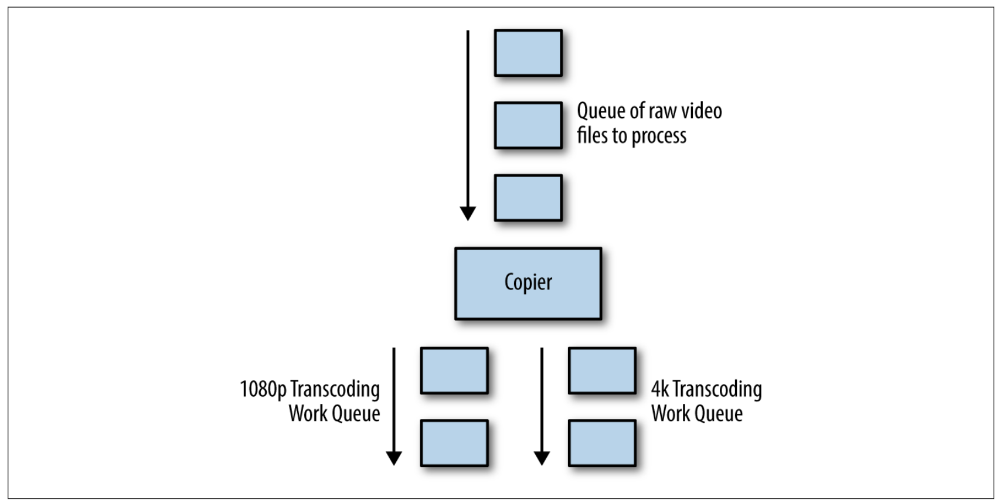
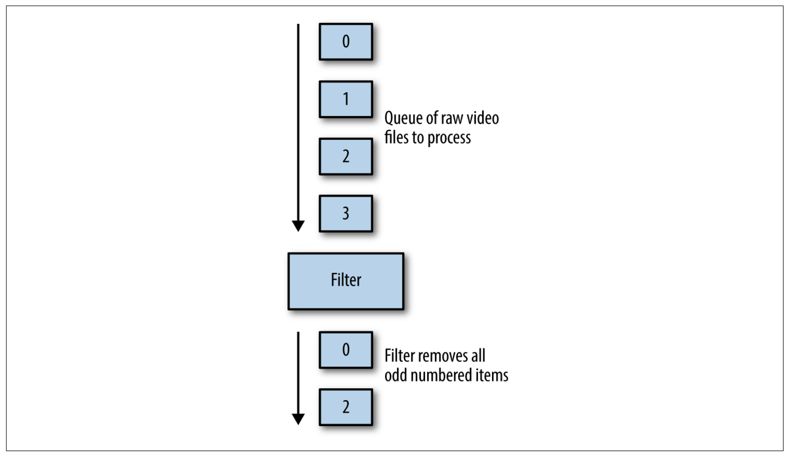
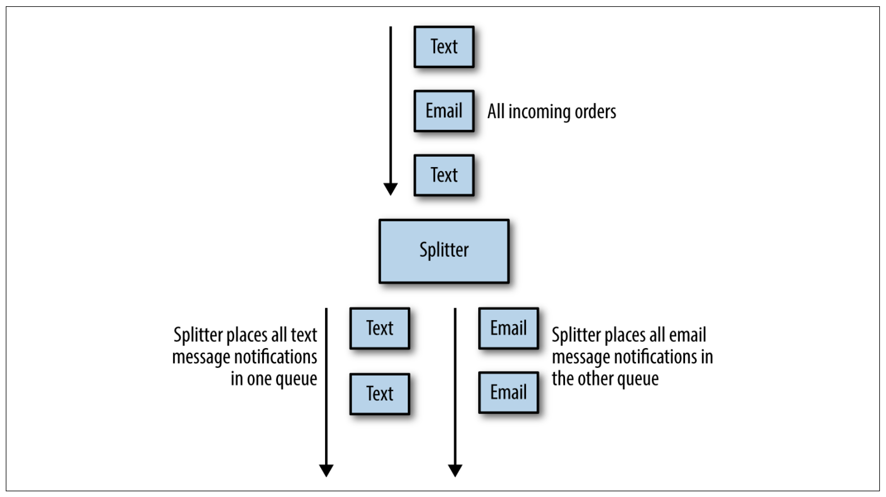
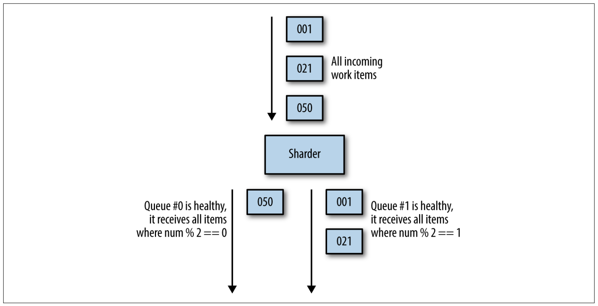
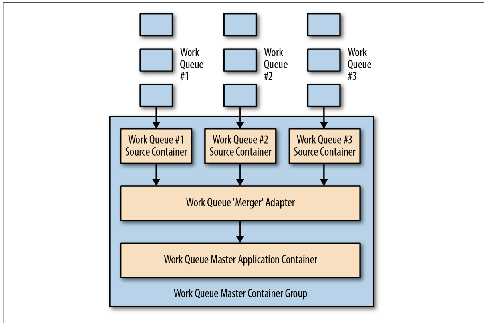
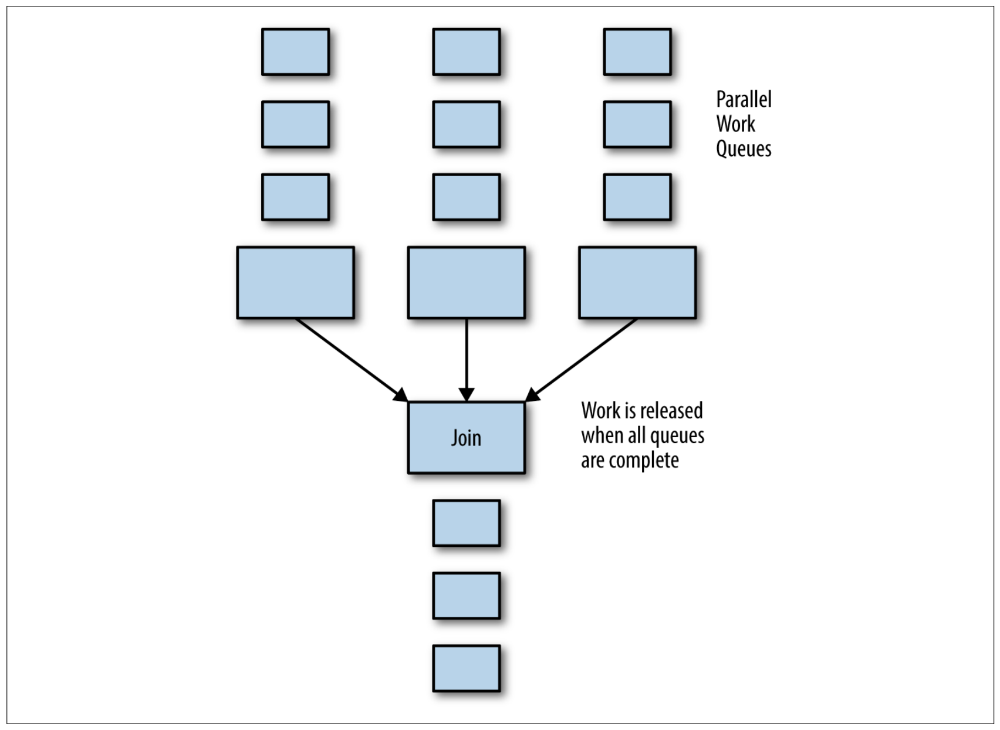
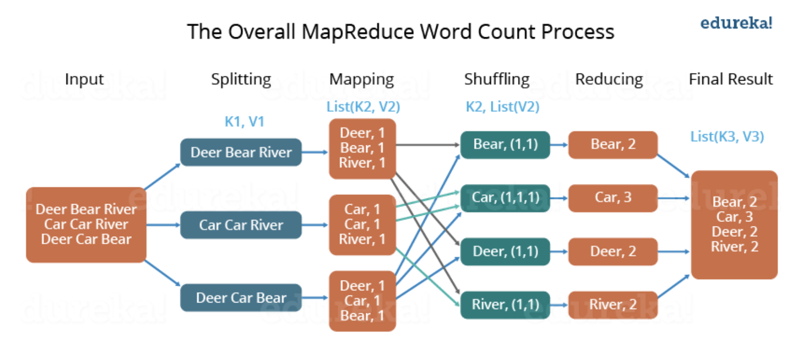
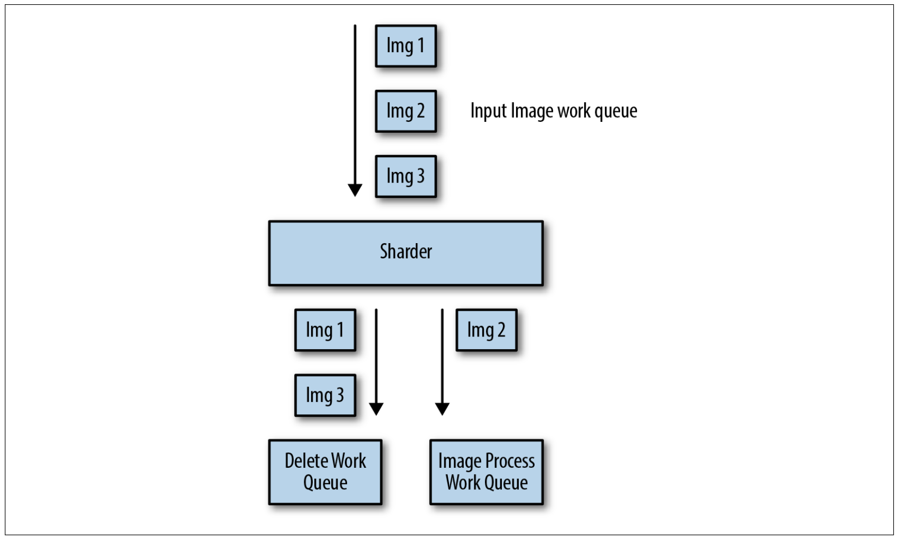
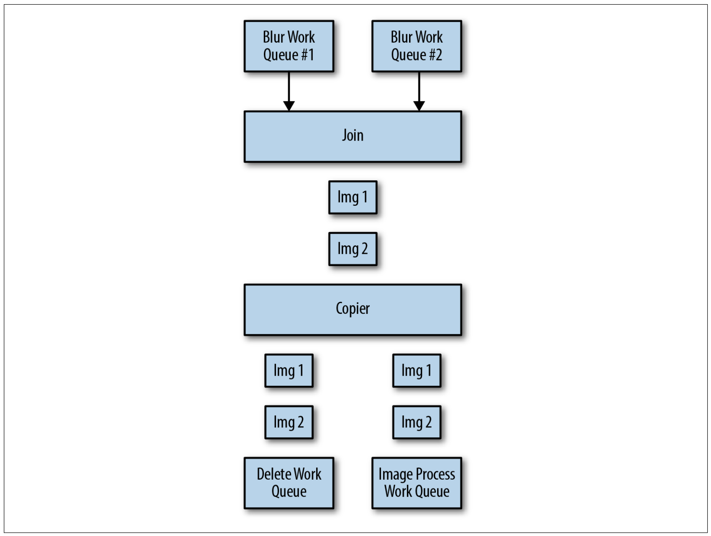

# 12章 協調的バッチ処理

---
## その前に すごーーくざっくりと 11章の話 (事前知識として)

10章ではシンプルなワークキューを紹介したが、それ以外のワークキュー同士をつなげパターンを紹介

---

### コピア

同一のデータを複数の Queue へ流す。



---

### フィルタ

その名の通り。



---

### スプリッタ

これもその名の通り。



---

### シャーダ

おなじみの。



---

### マージャ

待ち合わせなどの難しい処理はせず、複数の Queue から受け取ったデータを単一の Queue に流す。

---



---

## 結合(join)パターン (バリア同期)

- ワークフロー内で次のステージに移行する前に完全なデータセットが準備されている必要がある場合に用いる
- スレッドの **結合** と似ている
- 並列に処理を実行するが、ワークアイテムの並列処理のすべてが完了するまで結合処理からワークアイテムは取り出せない

---



---

:+1: **メリット** 

- データセット内のすべてのデータが揃っていることが保証される

:-1: **デメリット**

- 最も遅いワーカーの処理時間に引っ張られるので全体のレイテンシが長くなる

---

## Reduce

- いわゆる [**Map/Reduce**]((https://static.googleusercontent.com/media/research.google.com/ja//archive/mapreduce-osdi04.pdf)) の **Reduce** (Map は シャーディングに対応すると11章で説明があるらしい)
- すべてのデータの処理が終わるのを待つのではなく、並列処理されたデータアイテム全部を1つの総合的なものに楽観マージする

---

:+1: **メリット** 

- Map やシャーディングのフェーズの途中からも開始できる
- 終わったワーカーの出力から順に処理を始めることができる

:-1: **デメリット**

- Reduce パターンに適用できる集約処理は限られている

---

### ハンズオン(?): カウント

Map/Reduce 定番の例である ワードカウント



---

### 合計

`(自治体, 人口)` 形式のタプルが生成されるとする。

`(Seattle, 4000000)`, `(Northampton, 25000)` といった単位の出力を受け取り、
それを足し合わせて `(Seattle-Northampton, 4025000)` のような新しい **入力** を生成する。

→ Reduce は同じコードを同じ間隔で任意の回数繰り返せることがわかる(最終的にアメリカ全体の人口が得られる)。

**すべての処理がほぼ並列で行われる**

---

### ヒストグラム

並列シャーディングとMapReduceを用いてアメリカ合衆国の総人口に加えて、平均的なアメリカの家庭のモデルを作りたいとする。

→ 家庭の大きさ(子供の人数ごとの家庭の数)をヒストグラムにしたい

自治体ごとに 以下のような値を算出する(擬似コードなのでJSONに準拠していない部分は許してください)。

```
{0: 15%, 1: 25%, 2: 50%, 3: 10%, 4: 5%}
```

(100% 超えているが大丈夫なのか??))

これらの値同士も sum を保持しておけば Reduce 処理を行うことが可能

---

## ハンズオン(?): 画像のタグ付けと処理パイプライン

対象: ラッシュアワーの高速道路の画像の集合(大量)
- 乗用車・トラック・バイクの数を数える
- 車種ごとの色の分散も取得
- 匿名性を保つためにナンバープレートにモザイク処理を行う

---

10章で紹介したマルチワーカパターンを用いる。

図が間違っている気がする…

~~Delete Work Queue~~ 

↓

**Image Process Work Queue** (正確には Bluer Work Queue では?)



---



前のページか行ったぼかし処理を join で待ち合わせて削除処理と画像認識の処理を行う。

それぞれの処理にはコピアを用いて同一のデータを流す。

(日本語版は間違ってた)

---

最後に、前のページの **Image Process Work Queue** の処理として以下を行う。

- 車種と色を識別し、それらの統計情報をまとめて最終的な数を出す
    - Map
        - 車の場所と車種を識別するワーカ
        - 色の範囲を識別するワーカ
    - Reduce
        - 各パラメータを集約

---

サンプル JSON

```
{ 
   "vehicles":{ 
      "car":12,
      "truck":7,
      "motorcycle":4
   },
   "colors":{ 
      "white":8,
      "black":3,
      "blue":6,
      "red":6
   }
}
```

このデータをマージしていけば最終的に合計が求められそう!!

---

**まとめなし**

**13章がまとめっぽいよ!!**