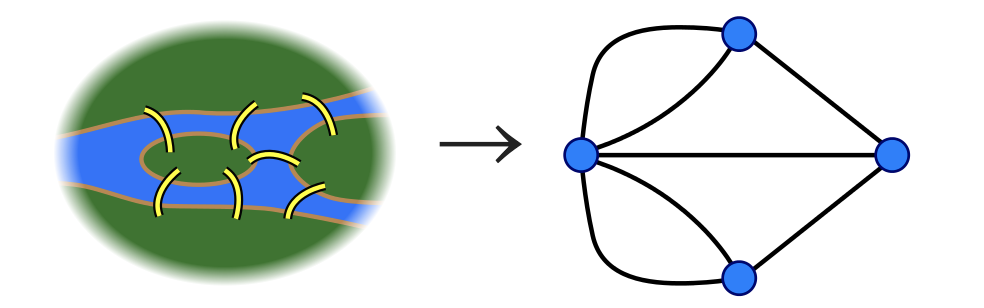
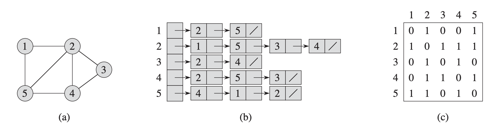

# 基本的グラフアルゴリズム

- グラフの表現
- グラフの探索
    - すべての点を訪問できるようにグラフの辺を組織的に辿る

**の前にそもそもグラフがわかってない**

## 補足: グラフについて

### グラフの起源

グラフ理論は数学の歴史の中では比較的新しく、発祥となったのは今から300年ほど前の「ケーニヒスベルクの7つの橋の問題」らしい。

[ケーニヒスベルクの七つの橋問題 | 一筆書き - Wikipedia](https://ja.wikipedia.org/wiki/%E4%B8%80%E7%AD%86%E6%9B%B8%E3%81%8D#%E3%82%B1%E3%83%BC%E3%83%8B%E3%83%92%E3%82%B9%E3%83%99%E3%83%AB%E3%82%AF%E3%81%AE%E4%B8%83%E3%81%A4%E3%81%AE%E6%A9%8B%E5%95%8F%E9%A1%8C)



### グラフとは

> **グラフ**とは、いくつかの点と、点を結ぶ線で構成される図のことである。

分野によって用語が様々らしい。

点(point)は、頂点(vertex)、結節点(node)などと呼ばれ、線(line)は、辺(edge)、枝(edge)、リンク(link)などとも呼ばれている。

参考: [あたらしいグラフ理論入門 | 小林 みどり |本 | 通販 | Amazon](https://www.amazon.co.jp/%E3%81%82%E3%81%9F%E3%82%89%E3%81%97%E3%81%84%E3%82%B0%E3%83%A9%E3%83%95%E7%90%86%E8%AB%96%E5%85%A5%E9%96%80-%E5%B0%8F%E6%9E%97-%E3%81%BF%E3%81%A9%E3%82%8A/dp/4434177273)

本書では **頂点(vertex)** と **辺(edge)** と表記されている。

### 表記

グラフは、頂点の集合 $V$ と辺の集合 $E$ の2つ決まる。グラフは普通は $G$ で表し、 $G=(V,E)$ と書く。集合 $V$ は有限集合であるが、空集合ではないとする(つまり頂点が少なくとも1つはある)。集合 $E$ は空集合でもよい(辺が1つもなくてもよい)。

参考: [あたらしいグラフ理論入門 | 小林 みどり |本 | 通販 | Amazon](https://www.amazon.co.jp/%E3%81%82%E3%81%9F%E3%82%89%E3%81%97%E3%81%84%E3%82%B0%E3%83%A9%E3%83%95%E7%90%86%E8%AB%96%E5%85%A5%E9%96%80-%E5%B0%8F%E6%9E%97-%E3%81%BF%E3%81%A9%E3%82%8A/dp/4434177273)

## 22.1 グラフの表現

グラフ $G=(V,E)$ の標準的な表現方法

- 隣接リスト表現 (adjacency-list representation)
- 隣接行列表現 (adjacency-matrix representation)

これらは有向グラフ・無向グラフどちらも表現可能

- グラフが密($|E|$ が $|V|^2$ にほぼ等しい): 隣接行列が好ましい
- グラフが疎($|E|$ が $|V|^2$ よりずっと小さい): 隣接リストがコンパクトになるので好ましい

次の図の (a) がもとのグラフ、(b) が隣接リスト表現、(c)が隣接行列表現



### 隣接リスト表現

- $V$ の拡張点に対し1個、全部で長さ $|V|$ のリスト
- 隣接リスト $Adj[u]$ は $G$ において $u$ に隣接するすべての頂点から構成される
- 利点: $Θ(V+E)$ の記憶量しか必要としない
- 欠点: 辺 $(u,v)$ がグラフに属するか否かの判定する際に $Adj[u]$ の中から $v$ を探索するより速い方法がない

### 隣接行列表現

- 頂点に番号 $1,2,...,|V|$ が振られていると仮定
- $|V| × |V|$ 型行列
- see: `p.493`
- 利点: 辺 $(u,v)$ がグラフに属するか否かの判定が隣接リスト表現よりも速い
- 欠点: $Θ(V^2)$ の記憶量が必要

### 練習問題(メモ)

#### 22.1-1

TODO: 次数の補足

出次数(out degree)は $|Adj[u]|$ の長さを比較すれば良いので $O(|V|)$

入次数(in degree)は全スキャンになるので $O(|V|+|E|)$

#### 22.1-2

$$
\begin{bmatrix}
0 & 1 & 1 & 0 & 0 & 0 & 0 & 0\\
1 & 0 & 0 & 1 & 1 & 0 & 0 & 0\\
1 & 0 & 0 & 0 & 0 & 0 & 1 & 1\\
0 & 1 & 0 & 0 & 0 & 0 & 0 & 0\\
0 & 1 & 0 & 0 & 0 & 0 & 0 & 0\\
0 & 0 & 1 & 0 & 0 & 0 & 0 & 0\\
0 & 0 & 1 & 0 & 0 & 0 & 0 & 0\\
\end{bmatrix}
$$

```
1: 2, 3
2: 1, 4, 5
3: 1, 6, 7
4: 2
5: 2
6: 3
7: 3
```
#### 22.1-3

隣接行列表現の場合は転置する処理だけなので $O(|V|^2)$ ??

隣接リスト表現は全操作して新しいリストに追加していくだけなので $O(|V|+|E|)$ ??

#### 22.1-4

- **「同等な」** とは??
- **すでに同じ辺を追加したか**を覚えておく一時配をを用意する? (サイズは $|V|$ )

#### 22.1-5

たすけてください

#### 22.1-6

以下の解答ではスキャンしきれない気がする

[https://sites.math.rutgers.edu/~ajl213/CLRS/Ch22.pdf](https://sites.math.rutgers.edu/~ajl213/CLRS/Ch22.pdf)
