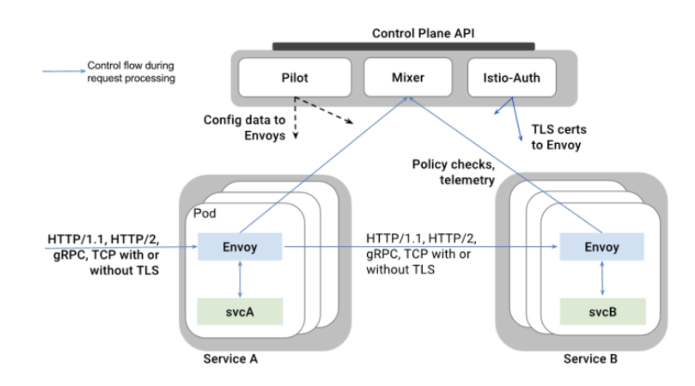
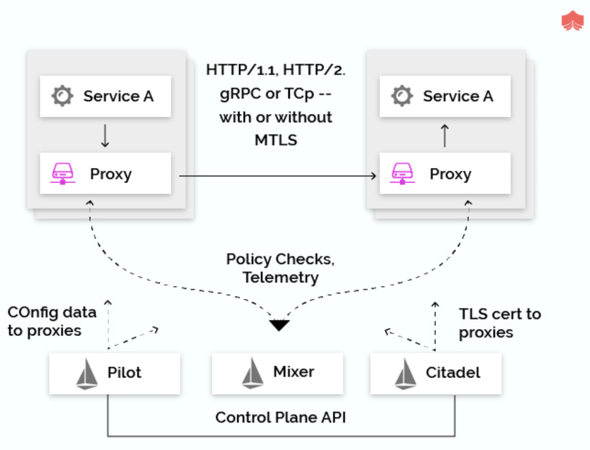

# 60min: Istio step-by-step Part 01 - Introduction to Istio

- サービスメッシュ流行ってるよね
- Istio はオープンソースのサービスメッシュだよ
- 既存の分散アプリケーションに透過的にデプロイできるよ
- Istio の目的はマイクロサービスを効率的に実行し、セキュリティ・接続・モニタリングに統一的な方法をもたらすことだよ

## じゃあ service mesh ってなに?

Service mesh はマイクロサービスのアプリケーション間の通信を構成するネットワークです。

以下の要素が求められます。

- Discovery
- Load balancing
- Failure recovery
- Metrics
- Monitoring
- A/B testing
- Canary releases
- Rate limiting
- Access control
- End-to-end authentication

## なぜそこまで istio が重要なの??

Istio を用いることで load balancing, service-to-service authentication, monitoring などを含んだ サービスのネットワークを簡単に構築することができます。

Istio では **control plane** によって管理される特殊な sidecar proxy がすべてのネットワークの通信をインターセプトし、以下のような機能を実現します。

- HTTP, gRPC, WebSocket, TCP トラフィックの負荷分散
- 豊富なルーティングルール、リタイア、フェイルオーバー、フォールトインジェクションによるトラフィックのきめ細かな制御

**補足: フォールトインジェクションってなに??**
意図的にシステムに障害を発生させること

ref: 
- [Istio入門 その4 -基礎から振り返る- - Qiita](https://qiita.com/Ladicle/items/4ba57078128d6affadd5#%E4%BA%8B%E5%89%8D%E3%81%AB%E9%9A%9C%E5%AE%B3%E3%82%92%E3%82%B7%E3%83%9F%E3%83%A5%E3%83%AC%E3%83%BC%E3%83%88%E3%81%99%E3%82%8B%E3%81%93%E3%81%A8%E3%81%A7%E5%A4%A7%E8%A6%8F%E6%A8%A1%E9%9A%9C%E5%AE%B3%E3%81%AB%E5%82%99%E3%81%88%E3%82%8B)
- [Fault Injection](https://istio.io/docs/tasks/traffic-management/fault-injection/)

- アクセス制御、レイトリミット、クオータなどを pluggable に設定可能
- 自動的にメトリクス、ログ、トレーシングを収集
- 強力な identity-based authentication & authorization を用いることでセキュアな service-to-service の通信を実現

## Istio の主要機能を見ていこう

Istio の主要な 5つのコア機能は、

- Traffic Management
- Security
- Observability
- Platform support
- Integration and customization

 

Istio のサービスメッシュは **data plane** と **control plane** から構成されています。

- Data plane - Envoy(拡張)
- Control plane - トラフィックをルーティングするために、proxy を管理、設定する

Istio アーキテクチャの中で最も重要なものを伝えます。

まず最初に **Envoy** です。

Envoy は以下のような機能を備えている C++ で書かれた高機能プロキシです。以下のような機能をビルトインで備えています。

- Dynamic service discovery
- Load balancing
- TLS termination
- HTTP/2 and gRPC proxies
- Circuit breakers
- Health checks
- Staged rollouts with %-based traffic split
- Fault injection
- Rich metrics

**いつもの Envoy が sidecar としてデプロイされるよという話なので割愛**

次に **Mixer** です。

Mixer はプラットフォーム非依存なコンポーネントで、アクセス制御や usage policy, telemetry data の収集をします。
Proxy はリクエストレベルでアトリビュートを抽出し、Mixer に送信され、評価されます。

pluggable で拡張性も高い。

次に **Pilot** です。

Pilot は、
- Envoy への サービスディスカバリ
- トラフィックマネージメント
    - A/B testing
    - canary deployments
    - etc.
- resiliency 
    - timeouts
    - retries
    - circuit breakers
    - etc.

高いレベルのルーティングルールを Envoy が解釈できるコンフィグへ変換し、それらを sidecar へ伝搬させます。
Pilot はサービ特有のサービスディスカバリを抽象化し、Envoy データプレーン API に準拠する sidexar が使用できる標準形式に統合します。
このような疎結合により、istio は Kubernetes, Consul, Nomad などのプラットフォームで同じオペレータが動作可能なのです。

次は **Citadel** です。

Citadel はビルトインの identity, credential management を用いて、強力な service-to-service, end-user の認証を提供します。
セキュリティ(認証・認可)周り担当。

最後は **Galley** です。

他の istio コンポーネントに代わってユーザーが作成した istio API 構成を検証します。
やがて、Galley は istio の最上位の構成の取り込み、処理、及び配布するコンポーネントとしての責任を引き継ぎます。
(???)