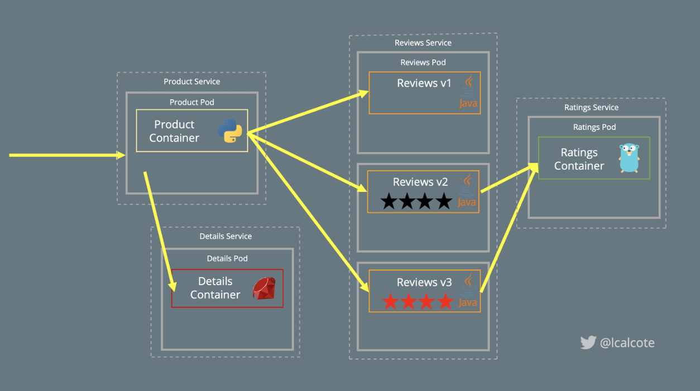
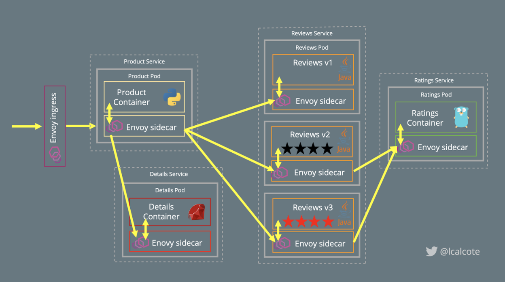

# istio: Up and Running 4

- istio と仲良くなるためには動かすしかない!!
- itsio がサポートしている環境を準備する。
- istio はいくつかのデプロイオプションに対して多数の機能を提供する

## Preparing Your Environment for Istio

- おなじみの `Bookinfo` アプリを用いる。
- platform は Kubernetes
- Docker for Desktop を使う
  - Kubernetes を動かす方法はいくつかあるが一番楽
- Docker for Desktop が動くローカルマシーンがKubernetesのシングルノードクラスタ
- 以下のリソースは最低限割く
  - `CPUs: 2`
  - `Memory: 4.0 GiB`
  - `Swap: 1.0 GiB`

### DEPLOYING KUBERNETES

`kubectl` は入っている前提

```bash
$ kubectl version --short
Client Version: v1.14.2
Server Version: v1.14.6
```

```bash
$ kubectl get nodes
NAME             STATUS   ROLES    AGE   VERSION
docker-desktop   Ready    master   14d   v1.14.6
```

本のURLが違った

```bash
$ kubectl apply -f https://raw.githubusercontent.com/kubernetes/dashboard/v1.10.1/src/deploy/recommended/kubernetes-dashboard.yaml
```

```bash
$ curl -L https://git.io/getLatestIstio | ISTIO_VERSION=1.1.0 sh -
$ cd istio-1.1.0/
# set PATH to `istioctl`
$ export PATH=$PWD/bin:$PATH
$ istioctl version
version.BuildInfo{Version:"1.1.0", GitRevision:"82797c0c0649a3f73029b33957ae105260458c6e", User:"root", Host:"996cd064-49c1-11e9-813c-0a580a2c0506", GolangVersion:"go1.10.4", DockerHub:"docker.io/istio", BuildStatus:"Clean", GitTag:"1.1.0-rc.6"}
```

## Istio Install Options

インストールの構成はいくつか存在する
一般的に次のように分類される

### CHOICE OF SECURITY CONFIGURATION

- `strict mTLS authentication`
  - 新しい Kubernetes クラスタに推奨
  - sidecar 間の認証を強制する
- `permissive mTLS authentication`
  - すでに存在する Kubernetes クラスタにインストールする場合に推奨
  - non-Istio Kubernetes Service と通信する必要がある場合に推奨
- `include or exclude certain default Istio components`
  - `mTLS` を使わない場合の `citadel` の削除など

### CHOICE OF DEPLOYMENT UTILITY

deployment utility を選択する場合は以下を考慮する

- Kubernetes マニフェストが `kubectl` で直接レンダリングされるか
- Istioの基盤をより明確に理解するために推奨されているか
- Ansible や Helm が Kubernetes マニフェストファイルをレンダリングするか
- テンプレート設定はプロダクション向けに推奨されているか

このリストは完全ではありません。
しかし、どの方法で Istio をインストールするにしても Kubernetes の Custom Resource Definitions (CRDs) はインストールされる。

## Registering Istio’s Custom Resources

CRD を Kubernetes にデプロイする

```bash
$ for i in install/kubernetes/helm/istio-init/files/crd*yaml; 
    do kubectl apply -f $i; done
customresourcedefinition.apiextensions.k8s.io/virtualservices.networking.istio.io created
customresourcedefinition.apiextensions.k8s.io/destinationrules.networking.istio.io created
customresourcedefinition.apiextensions.k8s.io/serviceentries.networking.istio.io created
customresourcedefinition.apiextensions.k8s.io/gateways.networking.istio.io created
customresourcedefinition.apiextensions.k8s.io/envoyfilters.networking.istio.io created
customresourcedefinition.apiextensions.k8s.io/clusterrbacconfigs.rbac.istio.io created
customresourcedefinition.apiextensions.k8s.io/policies.authentication.istio.io created
customresourcedefinition.apiextensions.k8s.io/meshpolicies.authentication.istio.io created
customresourcedefinition.apiextensions.k8s.io/httpapispecbindings.config.istio.io created
customresourcedefinition.apiextensions.k8s.io/httpapispecs.config.istio.io created
customresourcedefinition.apiextensions.k8s.io/quotaspecbindings.config.istio.io created
customresourcedefinition.apiextensions.k8s.io/quotaspecs.config.istio.io created
customresourcedefinition.apiextensions.k8s.io/rules.config.istio.io created
...
```

このインストールでは Helm は使用していない。
一般的にプロダクションで使用するには Helm または Ansible を用いるのが好ましい。
上記の2つを用いればどのコンポーネントをインストールするのかを詳細にカスタマイズできる。

```bash
kubectl  api-resources | grep istio
meshpolicies                                   authentication.istio.io        false        MeshPolicy
policies                                       authentication.istio.io        true         Policy
adapters                                       config.istio.io                true         adapter
apikeys                                        config.istio.io                true         apikey
attributemanifests                             config.istio.io                true         attributemanifest
authorizations                                 config.istio.io                true         authorization
bypasses                                       config.istio.io                true         bypass
checknothings                                  config.istio.io                true         checknothing
...
```

Istio は新たな CRD を登録している。

```bash
kubectl get crd | grep istio
adapters.config.istio.io               2019-10-21T13:24:08Z
apikeys.config.istio.io                2019-10-21T13:24:07Z
attributemanifests.config.istio.io     2019-10-21T13:24:07Z
authorizations.config.istio.io         2019-10-21T13:24:07Z
bypasses.config.istio.io               2019-10-21T13:24:07Z
checknothings.config.istio.io          2019-10-21T13:24:07Z
circonuses.config.istio.io             2019-10-21T13:24:07Z
...
```

```bash
$ kubectl get gateway
No resources found.
```

上記の `install/kubernetes/helm/istio-init/files/crd*yaml` ファイルをループする代わりに同じ CRD を含む `istio-demo.yaml` を適用する。
`istio-demo.yaml` は istio のコントロールプレーンも含んでいる。

一度 istio のカスタムリソースを登録すれば istio のコントロールプレーンをインストールできる。

## Installing Istio Control-Plane Components

`mTLS permissive mode` で istio をインストールするために `istio-demo.yaml` を指定する。

```
$ kubectl apply -f install/kubernetes/istio-demo.yaml
namespace/istio-system created
customresourcedefinition.apiextensions.k8s.io/virtualservices.networking.istio.io unchanged
customresourcedefinition.apiextensions.k8s.io/destinationrules.networking.istio.io unchanged
customresourcedefinition.apiextensions.k8s.io/serviceentries.networking.istio.io unchanged
customresourcedefinition.apiextensions.k8s.io/gateways.networking.istio.io unchanged
customresourcedefinition.apiextensions.k8s.io/envoyfilters.networking.istio.io unchanged
customresourcedefinition.apiextensions.k8s.io/clusterrbacconfigs.rbac.istio.io unchanged
customresourcedefinition.apiextensions.k8s.io/policies.authentication.istio.io unchanged
...
```

Istio のコントロールプレーンは `istio-system` ネームスペースにデプロイされる。
このネームスペースからすべてのネームスペースにおけるサービスを管理する(sidecar proxy を経由して)。言い換えると、他のすべてのネームスペースはサービスメッシュ上に存在することになる。

```bash
$ kubectl get namespaces
NAME              STATUS   AGE
default           Active   14d
docker            Active   14d
istio-system      Active   50m
kube-node-lease   Active   14d
kube-public       Active   14d
kube-system       Active   14d
squash-debugger   Active   14d
```

`-n istio-system` オプションを用いて istio のコンポーネントを確認できる。

```bash
$ kubectl get svc -n istio-system
NAME                     TYPE           CLUSTER-IP       EXTERNAL-IP   PORT(S)                                                                                                                                      AGE
grafana                  ClusterIP      10.98.70.2       <none>        3000/TCP                                                                                                                                     51m
istio-citadel            ClusterIP      10.111.157.74    <none>        8060/TCP,15014/TCP                                                                                                                           51m
...
```

```bash
$ kubectl get pod -n istio-system
NAME                                      READY   STATUS      RESTARTS   AGE
grafana-7b9f5d484f-kxlql                  1/1     Running     0          52m
istio-citadel-78dc9c74bb-722vg            1/1     Running     0          52m
istio-cleanup-secrets-1.1.0-dc27z         0/1     Completed   0          52m
...
```

「1つしかないのレプリカのPodがあるが単一障害点にはならないのか??」という質問が思いつくともいますが、それは正しいです。ダウンタイムが許容されない本番運用では高可用性(HA)アーキテクチャを採用する必要がある。

コントロールプレーンとの通信が切断・失敗した場合はどうするか?
幸いなことに、データプレーンにはコントロールプレーンコンポーネントに障害が発生したり、コントロールプレーンから切断された場合でもコンフィグを保持し、動作を継続できるresilienceが組み込まれている。

Istio の resilience はすげえや(小並感)
> Failures in distributed systems are near guaranteed.

ここまででサービスメッシュの半分であるコントロールプレーンをデプロイした。
サンプルアプリケーションをデプロイする前なので、プロキシーは実行されていないと考えるかもしれないが service proxy はすでに実行されている。
ingress と egress gateway は service proxy を起動・実行している。
詳しく見ていく。

`istioctl proxy-status` コマンドによってメッシュの概要を取得できる。
sidecar がコンフィグを受信していない、または同期されていないことを疑った場合は `proxy-status` が利用できる。
他にもデバッグに `istioctl` を用いることができる(詳しくは11章)。

```bash
$ istioctl proxy-status
NAME                                                   CDS        LDS        EDS               RDS          PILOT                            VERSION
istio-egressgateway-c4bd6b4b9-lbwcq.istio-system       SYNCED     SYNCED     SYNCED (100%)     NOT SENT     istio-pilot-696788f6c9-77w9n     1.1.0
istio-ingressgateway-5679bd865d-q6nxg.istio-system     SYNCED     SYNCED     SYNCED (100%)     NOT SENT     istio-pilot-696788f6c9-77w9n     1.1.0
```

コントロールプレーンがどのように gateway としてデプロイされた Envoy の構成管理を行っているかを理解することは、データプレーンでの Envoy インスタンスの管理方法に関連して啓発される。
思い出すと、データプレーンはアプリケーションサービスとともにサイドカーとしてデプロイされたインテリジェンスプロキシーで構成されている。
デプロイしてみる(`Bookinfo` サンプルをデプロイする)。

## Deploying the Bookinfo Sample Application

これを


こう


## Deploying the Sample App with Automatic Sidecar Injection

Envoy を各サービスに sidecar としてデプロイするために、istio は sidecar injector をデプロイする(詳しくは5章)。

なので今そ存在を確認する。

```bash
$ kubectl -n istio-system get deployment -l istio=sidecar-injector
NAME                     READY   UP-TO-DATE   AVAILABLE   AGE
istio-sidecar-injector   1/1     1            1           17h
```

`NamespaceSelector` を用いて sidecar を inject するかを決定する。具体的には以下のように `istio-injetino=enables` を指定する。

```bash
$ kubectl label namespace default istio-injection=enabled
namespace/default labeled
# 有効化されていることを確認
kubectl get namespace -L istio-injection
NAME              STATUS   AGE   ISTIO-INJECTION
default           Active   15d   enabled
docker            Active   15d
istio-system      Active   17h   disabled
kube-node-lease   Active   15d
kube-public       Active   15d
kube-system       Active   15d
squash-debugger   Active   15d
```

これで admissin webhook を変更することができた。
サンプルアプリをデプロイできます。

`istio-demo.yaml` によって automatic indection は設定されている。

サンプルアプリをデプロイ

```bash
$ kubectl apply -f samples/bookinfo/platform/kube/bookinfo.yaml
service/details created
deployment.extensions/details-v1 created
service/ratings created
deployment.extensions/ratings-v1 created
service/reviews created
deployment.extensions/reviews-v1 created
deployment.extensions/reviews-v2 created
deployment.extensions/reviews-v3 created
service/productpage created
deployment.extensions/productpage-v1 created
```

状態を確認

```bash
$ kubectl get pods
NAME                                READY   STATUS    RESTARTS   AGE
...
productpage-v1-95d579cd5-4896t      2/2     Running   0          3m4s
...

# 状態を確認
$ kubectl describe pod productpage-v1-95d579cd5-4896t
...
istio-proxy:
    Container ID:  docker://d9d7f4d9f48ad8be2d992294904ebf80d3bb30c505b607cc3940ff34999f32f0
    Image:         docker.io/istio/proxyv2:1.1.0
    Image ID:      docker-pullable://istio/proxyv2@sha256:cc1b1f5d62b198c998b207327a93a6f202059be5d79484accb9f6efc9ffbd3e4
    Port:          15090/TCP
    Host Port:     0/TCP
    Args:
      proxy
      sidecar
...
```

sidecar が自動でデプロイされていることが確認できた。

## Networking with the Sample App

ここまでで Bookinfo サービスは起動・実行されている。
Kubernetes クラスタ外からアクセス可能にする必要がある。
この役割を担うのが Istio Gateway である。

```bash
$ kubectl apply -f samples/bookinfo/networking/bookinfo-gateway.yaml
gateway.networking.istio.io/bookinfo-gateway created
virtualservice.networking.istio.io/bookinfo created

# 確認
$ kubectl get gateway
NAME               AGE
bookinfo-gateway   34s
```

外部エンドポイントを確認

```
$ echo "http://$(kubectl get nodes -o template --template='{{range.items}}{{range.status.addresses}}{{if eq .type "InternalIP"}}{{.address}}{{end}}{{end}}{{end}}'):$(kubectl get svc istio-ingressgateway -n istio-system -o jsonpath='{.spec.ports[0].nodePort}')/productpage"
```

これによってアプリケーションが実行され・アクセス可能になった。
トラフィックの設定はなされていない。

# Uninstalling Istio

`istio-system` ネームスペースを削除しただけでは istio はアンインストールされない。
よくあるミスだが、CRD や sidecar は残ってしまう。オペレータはこれらを明示的に削除するのがよい。
しかし、istio のアンインストールは以下のコマンドを実行するぐらい簡単です。

```bash
kubectl delete -f install/kubernetes/istio-demo.yaml
namespace "istio-system" deleted
customresourcedefinition.apiextensions.k8s.io "virtualservices.networking.istio.io" deleted
customresourcedefinition.apiextensions.k8s.io "destinationrules.networking.istio.io" deleted
...
```

これでは Istio の CRD, mesh configuration, sample application が残ります。
デリートするには以下のコマンドを実行します。

```bash
$ for i in install/kubernetes/helm/istio-init/files/crd*yaml;
     do kubectl delete -f $i; done
$ kubectl delete -f samples/bookinfo/platform/kube/bookinfo.yaml
$ kubectl delete -f samples/bookinfo/networking/bookinfo-gateway.yaml
```

リソースがないことを確認

```bash
$ kubectl get crds
$ kubectl get pods
# no outputs
```

## Install Helm

```bash
$ brew install kubernetes-helm
...

# すでにインストールされていたので upgrade
$ brew upgrade kubernetes-helm
...
```

## Install with Helm Template

- `istio-system` ネームスペースの作成
- helm コマンドで Kubernetes のマニフェストにレンダリングしたものを `kubectl apply` に渡すことで適用する (CRDなど)

```bash
$ kubectl create namespace istio-system
namespace/istio-system created
$ helm template install/kubernetes/helm/istio-init --name istio-init --namespace istio-system | kubectl apply -f -
configmap/istio-crd-10 created
configmap/istio-crd-11 created
serviceaccount/istio-init-service-account created
clusterrole.rbac.authorization.k8s.io/istio-init-istio-system created
clusterrolebinding.rbac.authorization.k8s.io/istio-init-admin-role-binding-istio-system created
job.batch/istio-init-crd-10 created
job.batch/istio-init-crd-11 created
$ helm template install/kubernetes/helm/istio --name istio --namespace istio-system | kubectl apply -f -
poddisruptionbudget.policy/istio-galley created
poddisruptionbudget.policy/istio-ingressgateway created
poddisruptionbudget.policy/istio-policy created
poddisruptionbudget.policy/istio-telemetry created
poddisruptionbudget.policy/istio-pilot created
configmap/istio-galley-configuration created
configmap/prometheus created
configmap/istio-security-custom-resources created
configmap/istio created
configmap/istio-sidecar-injector created
serviceaccount/istio-galley-service-account created
serviceaccount/istio-ingressgateway-service-account created
serviceaccount/istio-mixer-service-account created
serviceaccount/istio-pilot-service-account created
serviceaccount/prometheus created
serviceaccount/istio-cleanup-secrets-service-account created
clusterrole.rbac.authorization.k8s.io/istio-cleanup-secrets-istio-system created
clusterrolebinding.rbac.authorization.k8s.io/istio-cleanup-secrets-istio-system created
serviceaccount/istio-security-post-install-account created
clusterrole.rbac.authorization.k8s.io/istio-security-post-install-istio-system created
clusterrolebinding.rbac.authorization.k8s.io/istio-security-post-install-role-binding-istio-system created
serviceaccount/istio-citadel-service-account created
serviceaccount/istio-sidecar-injector-service-account created
serviceaccount/istio-multi created
clusterrole.rbac.authorization.k8s.io/istio-galley-istio-system created
clusterrole.rbac.authorization.k8s.io/istio-ingressgateway-istio-system created
clusterrole.rbac.authorization.k8s.io/istio-mixer-istio-system created
clusterrole.rbac.authorization.k8s.io/istio-pilot-istio-system created
clusterrole.rbac.authorization.k8s.io/prometheus-istio-system created
clusterrole.rbac.authorization.k8s.io/istio-citadel-istio-system created
clusterrole.rbac.authorization.k8s.io/istio-sidecar-injector-istio-system created
clusterrole.rbac.authorization.k8s.io/istio-reader created
clusterrolebinding.rbac.authorization.k8s.io/istio-galley-admin-role-binding-istio-system created
clusterrolebinding.rbac.authorization.k8s.io/istio-ingressgateway-istio-system created
clusterrolebinding.rbac.authorization.k8s.io/istio-mixer-admin-role-binding-istio-system created
clusterrolebinding.rbac.authorization.k8s.io/istio-pilot-istio-system created
clusterrolebinding.rbac.authorization.k8s.io/prometheus-istio-system created
clusterrolebinding.rbac.authorization.k8s.io/istio-citadel-istio-system created
clusterrolebinding.rbac.authorization.k8s.io/istio-sidecar-injector-admin-role-binding-istio-system created
clusterrolebinding.rbac.authorization.k8s.io/istio-multi created
role.rbac.authorization.k8s.io/istio-ingressgateway-sds created
rolebinding.rbac.authorization.k8s.io/istio-ingressgateway-sds created
service/istio-galley created
service/istio-ingressgateway created
service/istio-policy created
service/istio-telemetry created
service/istio-pilot created
service/prometheus created
service/istio-citadel created
service/istio-sidecar-injector created
horizontalpodautoscaler.autoscaling/istio-ingressgateway created
horizontalpodautoscaler.autoscaling/istio-policy created
horizontalpodautoscaler.autoscaling/istio-telemetry created
horizontalpodautoscaler.autoscaling/istio-pilot created
mutatingwebhookconfiguration.admissionregistration.k8s.io/istio-sidecar-injector created
attributemanifest.config.istio.io/istioproxy created
attributemanifest.config.istio.io/kubernetes created
metric.config.istio.io/requestcount created
metric.config.istio.io/requestduration created
metric.config.istio.io/requestsize created
metric.config.istio.io/responsesize created
metric.config.istio.io/tcpbytesent created
metric.config.istio.io/tcpbytereceived created
metric.config.istio.io/tcpconnectionsopened created
metric.config.istio.io/tcpconnectionsclosed created
handler.config.istio.io/prometheus created
rule.config.istio.io/promhttp created
rule.config.istio.io/promtcp created
rule.config.istio.io/promtcpconnectionopen created
rule.config.istio.io/promtcpconnectionclosed created
handler.config.istio.io/kubernetesenv created
rule.config.istio.io/kubeattrgenrulerule created
rule.config.istio.io/tcpkubeattrgenrulerule created
kubernetes.config.istio.io/attributes created
destinationrule.networking.istio.io/istio-policy created
destinationrule.networking.istio.io/istio-telemetry created
Error from server (Invalid): error when creating "STDIN": Job.batch "istio-cleanup-secrets-1.1.0" is invalid: spec.template.spec.affinity.nodeAffinity.requiredDuringSchedulingIgnoredDuringExecution.nodeSelectorTerms[0].matchExpressions[0].values: Required value: must be specified when `operator` is 'In' or 'NotIn'
Error from server (Invalid): error when creating "STDIN": Job.batch "istio-security-post-install-1.1.0" is invalid: spec.template.spec.affinity.nodeAffinity.requiredDuringSchedulingIgnoredDuringExecution.nodeSelectorTerms[0].matchExpressions[0].values: Required value: must be specified when `operator` is 'In' or 'NotIn'
Error from server (Invalid): error when creating "STDIN": Deployment.apps "istio-galley" is invalid: spec.template.spec.affinity.nodeAffinity.requiredDuringSchedulingIgnoredDuringExecution.nodeSelectorTerms[0].matchExpressions[0].values: Required value: must be specified when `operator` is 'In' or 'NotIn'
Error from server (Invalid): error when creating "STDIN": Deployment.apps "istio-ingressgateway" is invalid: spec.template.spec.affinity.nodeAffinity.requiredDuringSchedulingIgnoredDuringExecution.nodeSelectorTerms[0].matchExpressions[0].values: Required value: must be specified when `operator` is 'In' or 'NotIn'
Error from server (Invalid): error when creating "STDIN": Deployment.apps "istio-policy" is invalid: spec.template.spec.affinity.nodeAffinity.requiredDuringSchedulingIgnoredDuringExecution.nodeSelectorTerms[0].matchExpressions[0].values: Required value: must be specified when `operator` is 'In' or 'NotIn'
Error from server (Invalid): error when creating "STDIN": Deployment.apps "istio-telemetry" is invalid: spec.template.spec.affinity.nodeAffinity.requiredDuringSchedulingIgnoredDuringExecution.nodeSelectorTerms[0].matchExpressions[0].values: Required value: must be specified when `operator` is 'In' or 'NotIn'
Error from server (Invalid): error when creating "STDIN": Deployment.apps "istio-pilot" is invalid: spec.template.spec.affinity.nodeAffinity.requiredDuringSchedulingIgnoredDuringExecution.nodeSelectorTerms[0].matchExpressions[0].values: Required value: must be specified when `operator` is 'In' or 'NotIn'
Error from server (Invalid): error when creating "STDIN": Deployment.apps "prometheus" is invalid: spec.template.spec.affinity.nodeAffinity.requiredDuringSchedulingIgnoredDuringExecution.nodeSelectorTerms[0].matchExpressions[0].values: Required value: must be specified when `operator` is 'In' or 'NotIn'
Error from server (Invalid): error when creating "STDIN": Deployment.apps "istio-citadel" is invalid: spec.template.spec.affinity.nodeAffinity.requiredDuringSchedulingIgnoredDuringExecution.nodeSelectorTerms[0].matchExpressions[0].values: Required value: must be specified when `operator` is 'In' or 'NotIn'
Error from server (Invalid): error when creating "STDIN": Deployment.apps "istio-sidecar-injector" is invalid: spec.template.spec.affinity.nodeAffinity.requiredDuringSchedulingIgnoredDuringExecution.nodeSelectorTerms[0].matchExpressions[0].values: Required value: must be specified when `operator` is 'In' or 'NotIn'
```

なんかエラー出てるので**後で確認する**
Helm を用いて istio をインストールするメリットは `--set <key>=<value>` によってインストールするコンポーネントを以下のように選択できる点である。

```bash
$ helm install install/kubernetes/helm/istio --name istio --namespace istio-system \
    --set global.controlPlaneSecurityEnabled=true \
    --set mixer.adapters.useAdapterCRDs=false \
    --set grafana.enabled=true --set grafana.security.enabled=true \
    --set tracing.enabled=true \
    --set kiali.enabled=true
```

production における インストールオプションは以下を参考に
- [Installation Options](https://istio.io/docs/reference/config/installation-options/)

## Confirming a Helm-Based Installation

なんか正常に動作していない **上のエラーが関係していそうなので要調査**

 
