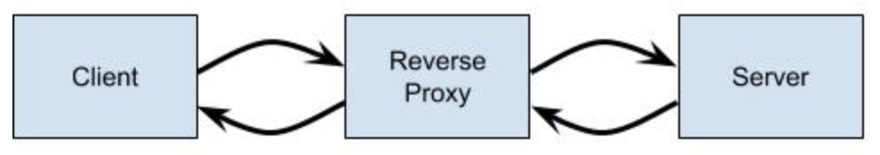
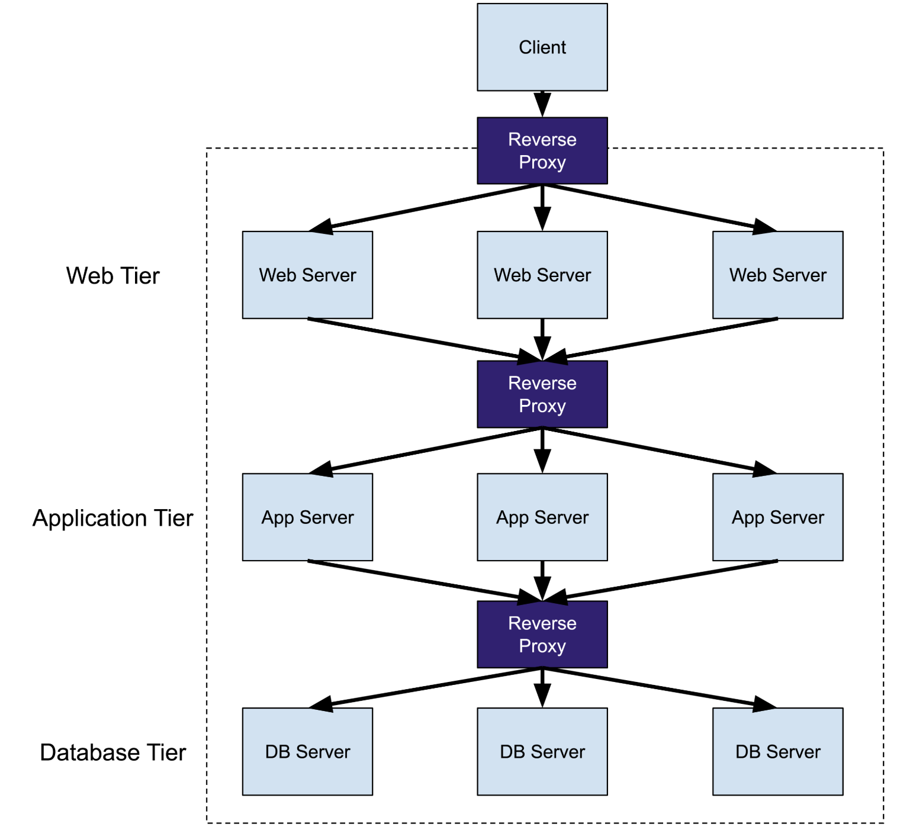
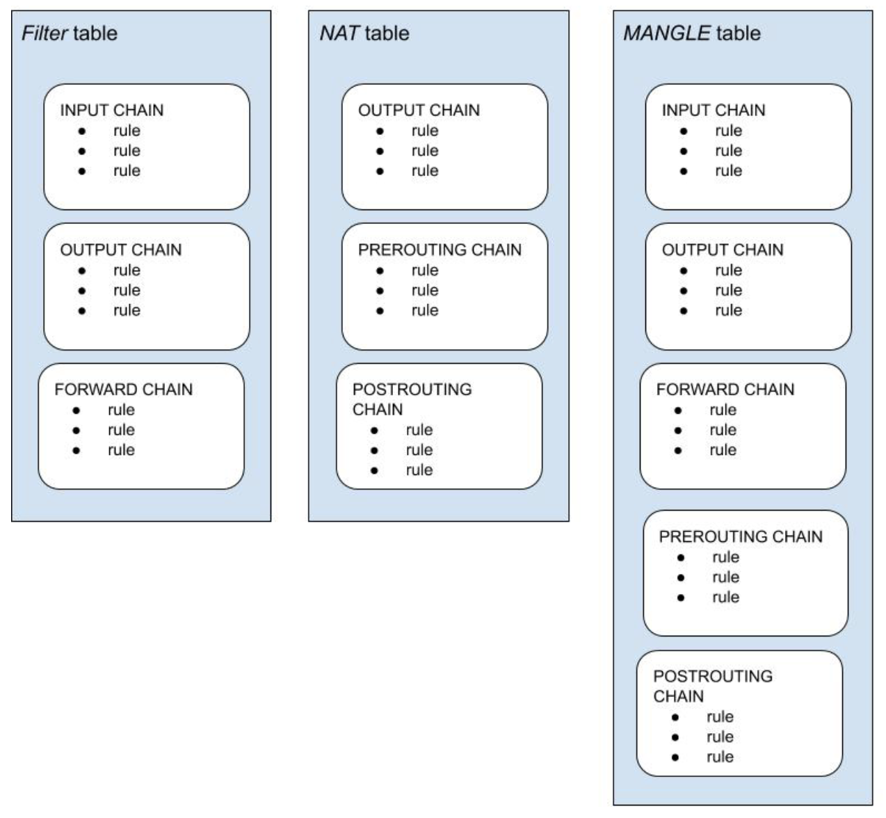

# istio: Up and Running 5. Service Proxy

*forward* と *reverse proxies* の違い

- *forward*
  - パフォーマンスの向上とトラフィックのフィルタリングを目的とし、アウトバウンドトラフィックに焦点を当てたフォワードプロキシーは通常プライベートネットワーク上のユーザーとインターネットのインタフェースとなる
  - ユーザーのフィルタリングや静的 Web コンテンツのキャッシュなどでパフォーマンスが向上
  - 大規模な組織のネットワークとインターネット間の通信のフィルタリングにも使われる
- *reverse proxies*
  - プライベートネットワークへのインバウンドトラフィックに焦点を当てている
  - 主な用途
    - セキュリティの向上
    - HTTPリクエストのフィルタリング
    - 負荷分散
  - サービスをユーザーに提供するのに用いられる

以下の図にもあるようにリバースプロキシーは自身がサーバーであるかのように振る舞う

コンフィグや実装にもよるが、大抵の場合はクライアントはリバースプロキシーを意識する必要はない(しそう作るべき)。

このコンセプトは resilience の高い3層構造の Web アプリケーションと変わらない。
これらの各層は従来では垂直にスケールする可能性がありますが、プロキシーはクライアント/サーバー通信に挿入され、負荷分散などの追加のネットワークサービスを提供するため、アプリケーションの resilience を向上させる。

プロキシーはサービスのプレースホルダを提供し、サービスへのアクセスを制御して中間のレベルを提供する。

## What Is a Service Proxy ?

リバースプロキシと同様に、 Service Proxy はサービスに変わってリクエストを送信するクライアント側の仲介者である。
Service Proxy を使用するとアプリケーションは呼び出しとしてチャンネルを介してメッセージを送受信できる。

(???) **どういうことだ?? gRPC??**

Service Proxy の接続は必要に応じて作成したり、開いた接続を維持してプールを促進できる。
Service Proxy は透過的に挿入され、アプリケーションは data plane の存在を意識する必要はありません。
Data plane はクラスタ内の通信は ingress も egress も担当する。

インバウンド(ingressing) でも アウトバウンド(egressing) でもトラフィックはまず Service Proxy に届けられ、処理される。

Istio の場合は iptable を用いて Service Proxy にリダイレクトされる。

### An iptable Primer

`iptable` は Linux でホストベースのファイアウォールとパケット操作を管理するための user-space CLI である。

`netfilter` は table, chains, comprising で構成される Linux カーネルモジュールである。

一般的に `iptable` 環境には複数のテーブルが含まれる: Filter, NAT, Mangle 及び Raw

独自の `iptable` を定義することも可能で、デフォルトでは *Filter* テーブルが使われる。

後で読む: [【丁寧解説】Linuxファイアウォール iptablesの使い方](https://eng-entrance.com/linux-firewall)

テーブルは複数のチェーンを含む。チェーンはユーザーが独自で定義可能かつ、複数のルールを含む。ルールはパケットにマッチ&マップする。
Istio が Envoy にトラフィックをリダイレクトするために使用している iptable は確認することができる。

チェーンはユーザースペースのネットワークなので他の Pod や Node へは影響を与えない。

Istio が作成した iptable を確認・更新できる。
Pod のコンテナに `exec` で入ると、以下のコマンドでアプリケーションとサイドカーコンテナの `NET_ADMIN` 機能が欠如していることが確認できる。

TOOD: **意味わからんので調べる**
