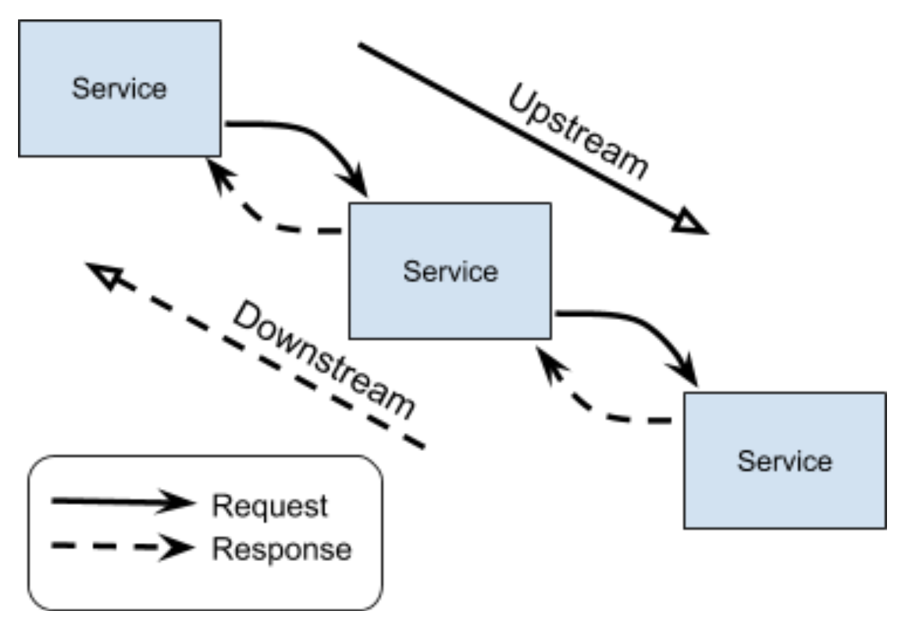
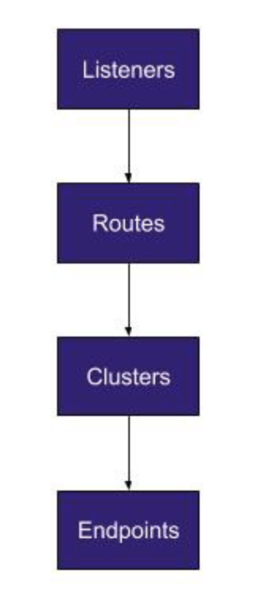

# istio: Up and Running 5. Service Proxy

*forward* と *reverse proxies* の違い

- *forward*
  - パフォーマンスの向上とトラフィックのフィルタリングを目的とし、アウトバウンドトラフィックに焦点を当てたフォワードプロキシーは通常プライベートネットワーク上のユーザーとインターネットのインタフェースとなる
  - ユーザーのフィルタリングや静的 Web コンテンツのキャッシュなどでパフォーマンスが向上
  - 大規模な組織のネットワークとインターネット間の通信のフィルタリングにも使われる
- *reverse proxies*
  - プライベートネットワークへのインバウンドトラフィックに焦点を当てている
  - 主な用途
    - セキュリティの向上
    - HTTPリクエストのフィルタリング
    - 負荷分散
  - サービスをユーザーに提供するのに用いられる

以下の図にもあるようにリバースプロキシーは自身がサーバーであるかのように振る舞う


コンフィグや実装にもよるが、大抵の場合はクライアントはリバースプロキシーを意識する必要はない(しそう作るべき)。

このコンセプトは resilience の高い3層構造の Web アプリケーションと変わらない。
これらの各層は従来では垂直にスケールする可能性がありますが、プロキシーはクライアント/サーバー通信に挿入され、負荷分散などの追加のネットワークサービスを提供するため、アプリケーションの resilience を向上させる。


プロキシーはサービスのプレースホルダを提供し、サービスへのアクセスを制御して中間のレベルを提供する。

## What Is a Service Proxy ?

リバースプロキシと同様に、 Service Proxy はサービスに変わってリクエストを送信するクライアント側の仲介者である。
Service Proxy を使用するとアプリケーションは呼び出しとしてチャンネルを介してメッセージを送受信できる。

(???) **どういうことだ?? gRPC??**

Service Proxy の接続は必要に応じて作成したり、開いた接続を維持してプールを促進できる。
Service Proxy は透過的に挿入され、アプリケーションは data plane の存在を意識する必要はありません。
Data plane はクラスタ内の通信は ingress も egress も担当する。

インバウンド(ingressing) でも アウトバウンド(egressing) でもトラフィックはまず Service Proxy に届けられ、処理される。

Istio の場合は iptable を用いて Service Proxy にリダイレクトされる。

### An iptable Primer

`iptable` は Linux でホストベースのファイアウォールとパケット操作を管理するための user-space CLI である。

`netfilter` は table, chains, comprising で構成される Linux カーネルモジュールである。

一般的に `iptable` 環境には複数のテーブルが含まれる: Filter, NAT, Mangle 及び Raw

独自の `iptable` を定義することも可能で、デフォルトでは *Filter* テーブルが使われる。


後で読む: [【丁寧解説】Linuxファイアウォール iptablesの使い方](https://eng-entrance.com/linux-firewall)

テーブルは複数のチェーンを含む。チェーンはユーザーが独自で定義可能かつ、複数のルールを含む。ルールはパケットにマッチ&マップする。
Istio が Envoy にトラフィックをリダイレクトするために使用している iptable は確認することができる。

チェーンはユーザースペースのネットワークなので他の Pod や Node へは影響を与えない。

Istio が作成した iptable を確認・更新できる。
Pod のコンテナに `exec` で入ると、以下のコマンドでアプリケーションとサイドカーコンテナの `NET_ADMIN` 機能が欠如していることが確認できる。

TOOD: **意味わからんので調べる**

※ ただの引用

```bash
$ iptables -t nat --list
Chain ISTIO_REDIRECT (2 references)
target     prot opt source               destination
REDIRECT   tcp  --  anywhere             anywhere             redir ports 15001
```

繰り返しになるが、トラフィックのポリシーは Pilot によって設定され、service proxy によって実装される。
**Service proxy の集合が data plane と呼ばれる。**

- Service proxies は以下を担当する
  - すべてのリクエストパケットをInterceptする
  - health checking
  - routing
  - load balancing
  - authentication
  - authorization
  - generation of observable signals

Proxy はクライアントが常に同じ場所へアクセスしているように振る舞うことを可能にする(permanent reference を提供する)。これによりシステムの resilience を高める。

# Envoy Proxy Overview

- Envoy は
  - L7 のロードバランサである
  - 汎用データプレーン API としてのニーズを満足している
  - オープンソースである
  - クラウドネイティブエコシステム内で幅広く利用されている

## Why Envoy ?

なぜ広く使われている NGINX ではないのか?
なぜ Linkerd v1, Conduit, HAProxy, Traefik ではないのか?

- 当時 Envoy はほとんど知られていなかった。
- Linkerd v1 は JVM ベースの service proxy
  - 性質上 Node エージェントには向いているが、sidecar には向いていない
  - (v2 はこれを改善しようとしているみたい)
- Envoy は当初から sidecar としてデプロイされることを想定していた

*hot reload* と *hot restarts* というコンセプトの違いが Istio が NGINX ではなく Envoy を採用した支配的な理由である。
Envoy のランタイム構成は当初からAPI駆動であり、ドレーン及びホットリロード(自身のプロセスを新しいプロセスとコンフィグに置き換える)が可能
Envoy は共有メモリと Unix Domain Socket (UDS) を介たし通信によってホットリロードじ実現する。これは ダウンタイムのない HAProxy リロードのための GitHub のツールと類似している。

後で読む:

- [調べなきゃ寝れない！と調べたら余計に寝れなくなったソケットの話 - Qiita](https://qiita.com/kuni-nakaji/items/d11219e4ad7c74ece748)
- [GLB part 2: HAProxy zero-downtime, zero-delay reloads with multibinder - The GitHub Blog](https://github.blog/2016-12-01-glb-part-2-haproxy-zero-downtime-zero-delay-reloads-with-multibinder/)

Envoy は Aggregated Discovery Service (ADS) を提供する(後述とのこと)。

## HTTP/2 AND gRPC

- Envoy の HTTP/2 と gRPC のサポートの早さは他のプロキシーと比較して一線を画していた
- HTTP/2 は1つの TCP コネクションで HTTP リクエストを多重化できる
  - HTTP/2 をサポートするプロキシーは多くの接続を1つにまとめることができ、オーバヘッドを大幅に削減できる
- HTTP/2 を使用するとクライアントはサーバープッシュを使用して並列のリクエストを送信し、リソースをプリエンプティブにロードできる

- Envoy は HTTP/1.1 及び HTTP/2 と互換性があり、ダウン・アップストリームの両方で各プロトコルのプロキシー機能を備えている

※ **gRPC の説明だったので割愛**

## Envoy in Istio

新しい情報なし


### Manual Sidecar Injection

`istioctl` を使用することで手動で sidecar をデプロイ可能

```bash
istioctl kube-inject -f samples/sleep/sleep.yaml | kubectl apply -f -
```

**`kube-inject` は冪等ではないらしい**

### Automatic Sidecar Injection

**この説明多くないか??**

Automatic sidecar injection を使うとアプリケーションコードだけでなく、Kubernetesのマニフェストファイルの変更も不要である。
`mutating admission webhooks` という Kubernetes の仕組みを用いている。

`istio-sidecar-injector` が `mutating webhook configuration` として istio インストール時に追加される

```
$ kubectl get mutatingwebhookconfigurations
NAME                                    CREATED AT
istio-sidecar-injector                  2019-04-18T16:35:03Z
linkerd-proxy-injector-webhook-config   2019-04-18T16:48:49Z
```

この `mutating webhook` が Kubernetes に `istio-injection=enable` とラベルが付いたネームスペースでPod が作成されたイベントをすべて `istio-sidecar-injector` に送信する用に設定する。
`istio-proxy` のテンプレートはコンフィグマップに格納されてる。

## Kubernetes Init Containers

おなじみの [cloud-init](https://cloudinit.readthedocs.io/en/latest/index.html) と同じように使える。
主要なコンテナが実行される前に一時的なコンテナを実行できる。

Init Containers は主に以下のような用途で用いられる

- bundling assets
- performing database migration
- cloning a Git repository into volume

Istio ではネットワークフィルター(iptable)を設定するために用いられます。

## Sidecar Resourcing

Istio v1.1 では sidecar 自体にリソース制限がデフォルトでかけられている。リソースの制限は水平スケーリングの本質である。sidecar の YAML を確認すると、mTLS を有効化しているに関わらず、volume が mount されている。

# Envoy's Functionality

他の Proxy と同様に Envoy もトラフィックを取り込むために network listener を用いる。
*upstream* と *downstream* はリクエストにおけるサービスの依存を表す。

- Downstream
  - send request -> receive response ...
- Upstream
  - receive request -> send response ...

※ **クライアントからのリクエストは除くということ??**




## Core Constructs

**listener** はダウンストリームのクライアントから接続を受け入れる名前付きのネットワークロケーションである(port, unix domain socket etc.)。
Envoy は1つ以上の listener を公開します。
これは多くの場合、外部クライアントが接続を確立できる外部公開ポートである。

listener は特定のポートにバインドする。物理リスナーはポートにバインドする。仮想リスナーは転送に利用される。
listener はリスナーフィルターのチェーンを使用してオプションを設定することができる。各フィルターを利用して接続のメタデータを操作したり、コア機能に変更を加えることなくシステムの統合を改善することが可能。

以下の図は Envoy の core constructs を表す。



listener, routes, clusters, endpoints は静的ファイル、またはAPIを用いて動的に設定することができる。
例えば、

- listener discovery service (LDS)
- route discovery service (RDS)
- cluster discovery service (CDS)
- endpoint discovery service (EDS)

静的ファイルは JSON or YAML

Envoy のAPIのディスカバリサービスの集合は **xDS** と呼ばれる。

コンフィグファイルによって上記の設定以外にも以下のような内容を記述する。

- どの API を有効化するか
- アクセスログはどこへ送信されるべきか
- tracing engine の設定

**Envoy は v1 と v2 で明確に区別されているので注意**

Pilot は Envoy と gRPC Stream で接続されており、更新を受け取る。

Istio Pilot は動的構成に Envoy の ADS を使用し、ルートテーブル、クラスター、及びリスナーの定義を一元化する。

Pilot は同じルールを複数のサービスプロキシに適用して、クラスター全体でサービスプロキシ構成の伝搬を容易にする。

Pilot はこれらの Envoy の API を使用し、構成をプッシュする。
デフォルトでは10秒ごとに設定がプッシュされる。(この値は `PILOT_DEBOUNCE_MAX` を使用して変更することができる)
以前はポーリングベースであったが、Envoy の新しい API は現在プッシュベースであり、スケーリングを改善し、決定的に Envoy に特定の順序で構成を指示できるようになっている。(gRPC)

## Certificates and Protecting Traffic

次はデフォルトのセキュリティ態勢について。
最近は設定可能なオプションとなりましたが、デフォルトの設定では Pilot は未定義のエンドポイントへの出力トラフィックを許可しません。Istio に受け入れ可能なエンドポイントであることを伝える必要があります。
Pilot はトポロジ・環境の変更を認識するとすぐに、データプレーンで影響を受けるサービスを再構成する必要があります。

変更の種類によっては Envoy Listeners は接続をクローズする必要があります。
Istio が意図的に接続を閉じる例は service identity credential (証明書) がローテートされる場合です。これは必須ではないが、Istio はサービスの証明書をリロードすると接続を終了します。Envoy の Secret Discovery Service (SDS) は各サービスプロキシに Secret (証明書) をプッシュできるメカニズムを提供する。(DNSについて詳しくは6章)

```
kubectl exec $(kubectl get pod | grep ratings-v1- | awk '{ print $1 }') -c istio-proxy ps
  PID TTY          TIME CMD
    1 ?        00:00:01 pilot-agent
   21 ?        00:00:04 envoy
   34 ?        00:00:00 ps
```

```
kubectl exec -it $(kubectl get pod | grep productpage | awk '{ print $1 }') -c istio-proxy -- cat /etc/certs/cert-chain.pem | openssl x509 -text -noout
...
```

上のコマンドで確認できた `pilot-agent` が証明書がローテートした際の Envoy のリスタートをハンドルしている。しかし、すでに確立しているコネクションは期限切れの証明書を使うが、istio はこの接続を意図的にクローズする。

サービスプロキシ間では mTLS 通信を確立するための証明書を使用する。
Istio のようなサイドカーを用いたサービスメッシュでは通常、アプリケーションとサイドカープロキシ間のPodローカル通信では暗号化されていないTCP接続を行います。言い方を変えると、サービスと Envoy はループバックアドレスを用いて Pod-local Network で通信している。

サービスと Envoy の通信には Kubernetes のネットワークポリシーを適用することはできない。トラフィックが Pod を出るときに初めて Kubernetes のネットワークポリシーを適用することができる。

### ADMINISTRATION CONSOLE

Envoy は管理ビューを提供し、configuration, stats, logs, internal Envoy data を表示できる。

Istio のデータプレーン内で実行中の特定サービスプロキシの管理コンソールへアクセスするには11章を参照。
Istio 外から管理コンソールへアクセスするための最もシンプルな方法は docker の利用である。


**Administration console が開かない**
以下のコマンドがエラーになる。(そもそも `envoy/envoy.yaml` がない or なんかディレクトリになっている )

```
docker run --name=proxy -d \
  -p 80:10000 \
  -v $(pwd)/envoy/envoy.yaml:/etc/envoy/envoy.yaml \
  envoyproxy/envoy:latest
```
