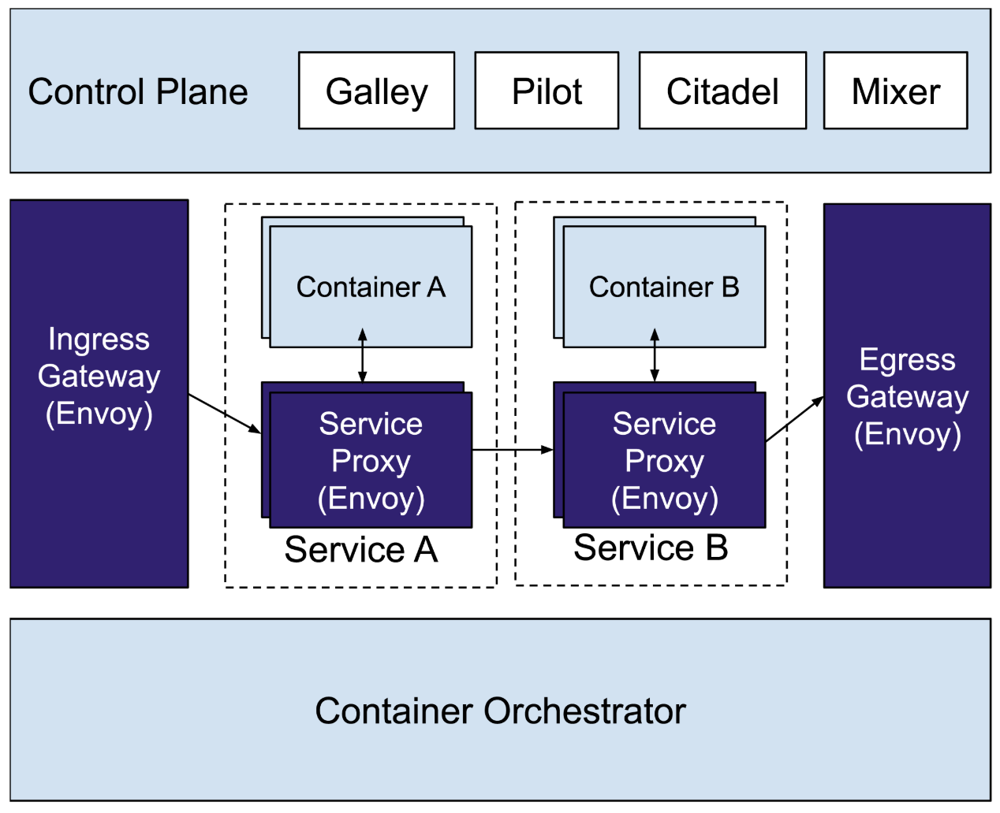

# istio: Up and Running 5. Service Proxy

*forward* と *reverse proxies* の違い

- *forward*
  - パフォーマンスの向上とトラフィックのフィルタリングを目的とし、アウトバウンドトラフィックに焦点を当てたフォワードプロキシーは通常プライベートネットワーク上のユーザーとインターネットのインタフェースとなる
  - ユーザーのフィルタリングや静的 Web コンテンツのキャッシュなどでパフォーマンスが向上
  - 大規模な組織のネットワークとインターネット間の通信のフィルタリングにも使われる
- *reverse proxies*
  - プライベートネットワークへのインバウンドトラフィックに焦点を当てている
  - 主な用途
    - セキュリティの向上
    - HTTPリクエストのフィルタリング
    - 負荷分散
  - サービスをユーザーに提供するのに用いられる

以下の図にもあるようにリバースプロキシーは自身がサーバーであるかのように振る舞う


コンフィグや実装にもよるが、大抵の場合はクライアントはリバースプロキシーを意識する必要はない(しそう作るべき)。

このコンセプトは resilience の高い3層構造の Web アプリケーションと変わらない。
これらの各層は従来では垂直にスケールする可能性がありますが、プロキシーはクライアント/サーバー通信に挿入され、負荷分散などの追加のネットワークサービスを提供するため、アプリケーションの resilience を向上させる。


プロキシーはサービスのプレースホルダを提供し、サービスへのアクセスを制御して中間のレベルを提供する。

## What Is a Service Proxy ?

リバースプロキシと同様に、 Service Proxy はサービスに変わってリクエストを送信するクライアント側の仲介者である。
Service Proxy を使用するとアプリケーションは呼び出しとしてチャンネルを介してメッセージを送受信できる。

(???) **どういうことだ?? gRPC??**

Service Proxy の接続は必要に応じて作成したり、開いた接続を維持してプールを促進できる。
Service Proxy は透過的に挿入され、アプリケーションは data plane の存在を意識する必要はありません。
Data plane はクラスタ内の通信は ingress も egress も担当する。

インバウンド(ingressing) でも アウトバウンド(egressing) でもトラフィックはまず Service Proxy に届けられ、処理される。

Istio の場合は iptable を用いて Service Proxy にリダイレクトされる。

### An iptable Primer

`iptable` は Linux でホストベースのファイアウォールとパケット操作を管理するための user-space CLI である。

`netfilter` は table, chains, comprising で構成される Linux カーネルモジュールである。

一般的に `iptable` 環境には複数のテーブルが含まれる: Filter, NAT, Mangle 及び Raw

独自の `iptable` を定義することも可能で、デフォルトでは *Filter* テーブルが使われる。


後で読む: [【丁寧解説】Linuxファイアウォール iptablesの使い方](https://eng-entrance.com/linux-firewall)

テーブルは複数のチェーンを含む。チェーンはユーザーが独自で定義可能かつ、複数のルールを含む。ルールはパケットにマッチ&マップする。
Istio が Envoy にトラフィックをリダイレクトするために使用している iptable は確認することができる。

チェーンはユーザースペースのネットワークなので他の Pod や Node へは影響を与えない。

Istio が作成した iptable を確認・更新できる。
Pod のコンテナに `exec` で入ると、以下のコマンドでアプリケーションとサイドカーコンテナの `NET_ADMIN` 機能が欠如していることが確認できる。

TOOD: **意味わからんので調べる**

※ ただの引用

```bash
$ iptables -t nat --list
Chain ISTIO_REDIRECT (2 references)
target     prot opt source               destination
REDIRECT   tcp  --  anywhere             anywhere             redir ports 15001
```

繰り返しになるが、トラフィックのポリシーは Pilot によって設定され、service proxy によって実装される。
**Service proxy の集合が data plane と呼ばれる。**

- Service proxies は以下を担当する
  - すべてのリクエストパケットをInterceptする
  - health checking
  - routing
  - load balancing
  - authentication
  - authorization
  - generation of observable signals

Proxy はクライアントが常に同じ場所へアクセスしているように振る舞うことを可能にする(permanent reference を提供する)。これによりシステムの resilience を高める。

# Envoy Proxy Overview

- Envoy は
  - L7 のロードバランサである
  - 汎用データプレーン API としてのニーズを満足している
  - オープンソースである
  - クラウドネイティブエコシステム内で幅広く利用されている

## Why Envoy ?

なぜ広く使われている NGINX ではないのか?
なぜ Linkerd v1, Conduit, HAProxy, Traefik ではないのか?

- 当時 Envoy はほとんど知られていなかった。
- Linkerd v1 は JVM ベースの service proxy
  - 性質上 Node エージェントには向いているが、sidecar には向いていない
  - (v2 はこれを改善しようとしているみたい)
- Envoy は当初から sidecar としてデプロイされることを想定していた

*hot reload* と *hot restarts* というコンセプトの違いが Istio が NGINX ではなく Envoy を採用した支配的な理由である。
Envoy のランタイム構成は当初からAPI駆動であり、ドレーン及びホットリロード(自身のプロセスを新しいプロセスとコンフィグに置き換える)が可能
Envoy は共有メモリと Unix Domain Socket (UDS) を介たし通信によってホットリロードじ実現する。これは ダウンタイムのない HAProxy リロードのための GitHub のツールと類似している。

後で読む:

- [調べなきゃ寝れない！と調べたら余計に寝れなくなったソケットの話 - Qiita](https://qiita.com/kuni-nakaji/items/d11219e4ad7c74ece748)
- [GLB part 2: HAProxy zero-downtime, zero-delay reloads with multibinder - The GitHub Blog](https://github.blog/2016-12-01-glb-part-2-haproxy-zero-downtime-zero-delay-reloads-with-multibinder/)

Envoy は Aggregated Discovery Service (ADS) を提供する(後述とのこと)。

## HTTP/2 AND gRPC

- Envoy の HTTP/2 と gRPC のサポートの早さは他のプロキシーと比較して一線を画していた
- HTTP/2 は1つの TCP コネクションで HTTP リクエストを多重化できる
  - HTTP/2 をサポートするプロキシーは多くの接続を1つにまとめることができ、オーバヘッドを大幅に削減できる
- HTTP/2 を使用するとクライアントはサーバープッシュを使用して並列のリクエストを送信し、リソースをプリエンプティブにロードできる

- Envoy は HTTP/1.1 及び HTTP/2 と互換性があり、ダウン・アップストリームの両方で各プロトコルのプロキシー機能を備えている

※ **gRPC の説明だったので割愛**

## Envoy in Istio

新しい情報なし



### Manual Sidecar Injection

`istioctl` を使用することで手動で sidecar をデプロイ可能

```bash
istioctl kube-inject -f samples/sleep/sleep.yaml | kubectl apply -f -
```
