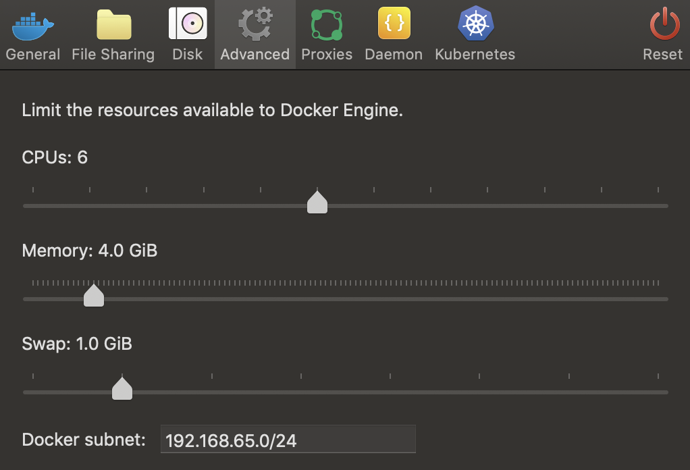

# Supplement

## Istio を最速でデプロイする

本書内ではコンポーネントを意識した istio のデプロイを行っていた。
「すぐに動かして挙動を剣侠したい」といった場合のために、最速でデプロイできる方法をメモする。

### 環境

```
docker desktop: 2.1.0.2 (37877)
Engine: 19.03.2
Kubernetes: v1.14.6
```



### 参考

- [Docker Desktop](https://istio.io/docs/setup/platform-setup/docker/)
- [Quick Start Evaluation Install](https://istio.io/docs/setup/install/kubernetes/)
- 

### やる

#### Install istio

```
curl -L https://git.io/getLatestIstio | ISTIO_VERSION=1.3.3 sh -
```

```
cd istio-1.3.3
```

config for `istioctl`

```
export PATH=$PWD/bin:$PATH
```

Deploy istio components

```
for i in install/kubernetes/helm/istio-init/files/crd*yaml; do kubectl apply -f $i; done
```

demo profile

```
kubectl apply -f install/kubernetes/istio-demo-auth.yaml
```

#### Install sample app

```
  kubectl apply -f samples/bookinfo/platform/kube/bookinfo.yaml
  kubectl apply -f samples/bookinfo/networking/bookinfo-gateway.yaml
```

完了