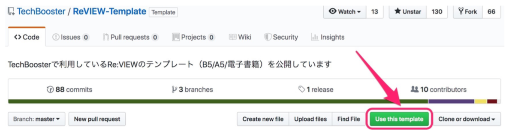

# 3. Re:VIEW

技術同人誌でよく使われる書籍執筆ツール [kmuto/review](https://github.com/kmuto/review) を用いる。

## 3.1 書籍執筆ツール

技術書の執筆において重要なのは紙の本として印刷できること。
印刷業界固有の事情に対応するために Re:VIEWを用いる。

## 3.2 Re:VIEW とは

学習コストが低く、専門知識がなくても商業誌レベルのクオリティにできる。
VCSとの相性もよく、エンジニアが本を書くのであれば最もバランスがいい。

### 3.2.1 Re:VIEW の利点

- レイアウトの調整が自動
- PDF を生成可能
   - EPUBや電子書籍向けのPDFにもできる
 - Markdown程度の文法で書ける


### 3.2.2 Re:VIEW テンプレート

有志によってテンプレートが公開されているので活用できる。

#### ReVIEW-Template

[TechBooster/ReVIEW-Template](https://github.com/TechBooster/ReVIEW-Template)

この本でも使われている

#### Re:VIEW Starter

柔軟なレイアウトに対応可能。
標準で満足できなくなったら使う。

### 3.2.3 Re:VIEW の情報源

- [kmuto/review](https://github.com/kmuto/review/blob/master/doc/format.ja.md)
- [技術書をかこう！ ～はじめてのRe:VIEW～ 改訂版【C92新刊】 - TechBooster - BOOTH](https://techbooster.booth.pm/items/586727)
- [Re:VIEWチートシート](https://gist.github.com/erukiti/c4e3189dda179a0f0b73299fb5787838)

## 3.3 Re:VIEW のセットアップ



レポジトリ作成 (今回は Private)

```
docker pull vvakame/review:3.1

docker run -t --rm vvakame/review:3.1 review version
3.1.0

# output pdf in `articles` directory
docker run -t --rm -v $PWD:/work -w /work/articles vvakame/review:3.1 \
        review-pdfmaker config.yml


# output epub in `articles` directory
docker run -t --rm -v $PWD:/work -w /work/articles vvakame/review:3.1 \
       review-epubmaker config.yml

```
